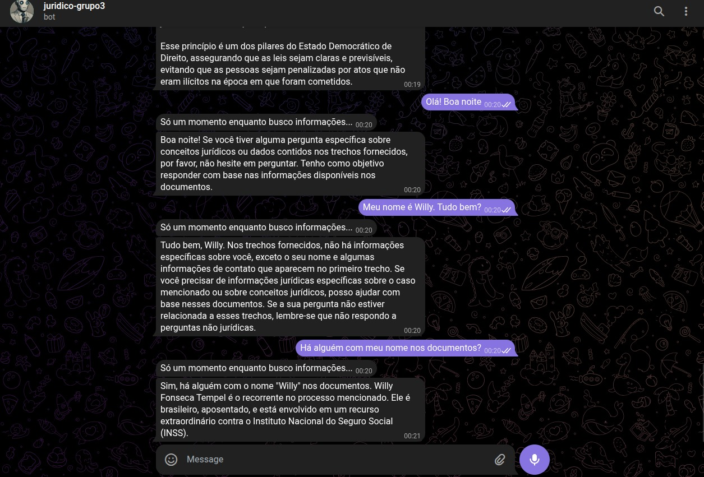

# Avaliação das Sprints 7 e 8 para formação em Inteligência Artificial com AWS.

# 🌐 Integração: Bot de Telegram + API de Chatbot com RAG

Este documento descreve o processo de criação e configuração da comunicação entre o bot do Telegram e a API formulada para a avaliação.

---

## 🎯 Objetivo

Criar um bot no Telegram que faça uso de uma API para consultar documentos jurídicos e responder sobre eles.

## ⚒️ Infraestrutura

- API em EC2, rodando com Flask, servida por Gunicorn e com Nginx como proxy reverso.
- Bucket S3 para armazenamento dos documentos jurídicos on-line.
- Aplicação para consumir a API que se comunica com o telegram.

Temos 3 aplicações dockerizada:

- API do processamento do ChatBot (Flask + Gunicorn)
- Aplicação para comunicação com o Telegram
- Proxy Reverso (Nginx)

A aplicação é Dockerizada e pode ser subida para a AWS com uso de Terraform.

---

## Subindo e Rodando a API

> Pré-requisitos: para testes locais, tenha instalado em sua máquina Docker. Para subir para a AWS, é necessário ter instalado Terraform.

1. Faça download do repositório, seja manualmente ou com uso de `git`.

2. Obtenha um *key pair* na AWS. Ele será usado pela EC2 para permitir conexões SSH.
  
    Para isso, vá em `EC2 > Network & Security > Key Pairs`. Clique em `Create Key Pair`. Escolha um nome, o tipo como "RSA" e o formato como ".pem". Clique, novamente em `Create Key Pair`. **Será feito o download de um arquivo .pem**. Guarde-o, pois será necessário usá-lo para acessar a instância EC2.

3. No diretório onde for feito o download, mova para a pasta de `terraform/`:

    ```bash
    terraform init
    terraform plan
    ```
    Várias perguntas serão feitas para preencher os dados necessários para subir a infraestrutura. Entre eles, o nome do Key Pair criado anteriormente! Também, o nome do Bucket - o qual deve ser único - e o endereço IP a que permitir conexões SSH.
    > Obs.: o endereço IP próprio pode ser visualizado no próprio console da AWS ao editar uma inbound ou outbound rule, em um Security Group e selecionar "My IP" em "Source". Cuidado, entretanto, para não realizar modificações indesejadas. Na dúvida, cancele.
    
    Caso toda a infraestrutura esteja adequada, podem-se aplicar as mudanças com:
    ```bash
    terraform apply
    ```
  
  4. Se as mudanças foram corretamente aplicadas, deve ter sido criado um bucket em sua conta AWS com o nome especificado. Faça upload dos documentos jurídicos desejados para ele.
  
  5. Mova de volta para o diretório raiz (onde estiver o repositório). Crie o arquivo `.env`, com base em `.env.example`:
  
      ```bash
      cp .env.example .env
      ```
      Preencha o arquivo `.env` gerado com as informações desejadas. Faça uso do que desejar do exemplo.

  6. Copie o código para a EC2:

      ```bash 
      rsync -avrz -e "ssh -i <CAMINHO_ARQUIVO_PEM>" <CAMINHO_DIRETORIO_ATUAL> ec2-user@<IP_PUBLICO_DA_EC2>:/home/ec2-user/api/ --exclude-from=copy-ignore.txt
      ```
      > Obs.: Troque os valores entre '<' e '>' pelos dados correspondentes.
    
  7. Por último, entre na EC2 com SSH e vá para /api/:
      ```bash 
      ssh -i "<CAMINHO_ARQUIVO_PEM>" ec2-user@<IP_PUBLICO_DA_EC2>
      ```
      ```bash 
        cd api/
      ```
      E, se não houver sido feito automaticamente, rode o script de inicialização na EC2. Ele se encontra em `terraform/ec2/start-script.sh`.
      ```bash 
      <comandos_do_script>
      ```

Após esses passos, é espero que o servidor esteja rodando normalmente. Isso ficará evidente pelos logs emitidos após execução do script de inicialização.
Caso não rode automaticamente, use `docker compose up --build`.

---

## ⚙️ Como criar e configurar o Bot do Telegram?

### 1. Criação do Bot no Telegram

1. Abra o app do Telegram e procure por [@BotFather](https://t.me/BotFather).
2. Envie o comando `/start` e depois `/newbot`.
3. Escolha o nome de exibição do seu bot.
4. Escolha um nome de usuário para o seu bot (deve terminar em `bot` - ex: `Chatbot_Juridico_bot`).
5. Copie e salve o **token** que o BotFather fornecer, pois ele será usado no `.env.telegrambot`.

### 2. Configurações possíveis com o BotFather:

* `/setdescription` – Define a descrição do seu bot.
* `/setabouttext` – Define o texto "Sobre" exibido no perfil do bot.
* `/setuserpic` – Define uma foto de perfil.
* `/deletebot` – Remove permanentemente o bot.
* `/setcommands` – Define comandos personalizados visíveis no menu do bot.

  **Exemplos de uso do `/setcommands`:**

  ```
  start - Inicia o bot
  ajuda - Mostra informações sobre o funcionamento do bot
  sobre - Exibe informações sobre o projeto
  ```
---

## 💻 Utilizando o Sistema

### Acesse o Bot através dos seguintes link de convite pra conversa:

- https://t.me/juridico_grupo3_bot
  
### Após acessar o bot sinta-se livre para começar o envio de mensagens!



## 🥔 Desenvolvimento da avaliação

Utilizamos o Trello como ferramenta de gerenciamento de tarefas, aliado a reuniões diárias (dailys), nas quais o progresso era compartilhado entre os integrantes da equipe.

Para enfrentar o desafio, dividimos o projeto em três frentes principais:

- Infraestrutura

- Criação e utilização do RAG

- Integração com o Telegram

Trabalhamos de forma paralela nessas três áreas até que restassem apenas tarefas de integração e correção de erros, que foram resolvidas até a conclusão do projeto.

## ❗Desafios encontrados durante o desenvolvimento do projeto

Durante o processo de desenvolvimento e implantação do chatbot, nos deparamos com alguns obstáculos que exigiram mudanças estratégicas na arquitetura do projeto. Abaixo estão alguns dos principais empecilhos encontrados:

---

### 🔹 Limite de tamanho das bibliotecas na AWS Lambda

Logo no início da atividade, ao tentar implementar o chatbot em uma função AWS Lambda, foi identificado que o **tamanho das bibliotecas necessárias ultrapassava o limite máximo** permitido para as layers, impossibilitando a execução da lógica do bot nesse formato.

✅ **Solução:**
Foi adotada a abordagem com **EC2** com **Docker**, permitindo rodar o bot com todas as dependências necessárias sem restrições de tamanho.

---

### 🔹 Definição Principal de Infraestrutura


#### API Gateway + Lambda

Primeira cogitação de foi utilizar de Lambda + API Gateway para montar a API que interagiria com o Telegram. Dificuldade: dependências do projeto excediam o tamanho aceito para Layers, necessitando uma abordagem com uso de Docker ou alguma alternativa.

#### API Gateway + EC2 (Flask + Gunicorn)

Com isso, analisamos utilizar de uma instância EC2 e API Gateway.

Para garantir maior segurança, tínhamos interesse em assegurar que a API da EC2 não atendesse a requisições externas, apenas às da API Gateway. Do que foi pesquisado, as abordagens apontavam para dois cenários: permitir acesso público à EC2 e realizar uma autenticação em sua API para verificar a origem como sendo a API Gateway; ou colocar a EC2 em rede privada e conectar à API Gateway por VPC Link (o que evitaria a exposição direta da EC2 completamente, mas demandaria custos adicionais consideráveis). Uma consideração que levantou preocupação era o cenário de ter uma API que devesse receber redirecionamentos apenas de API Gateway, mas que pudesse ser alvo de requisições externas, mesmo que não atendidas (um DDoS).

#### EC2 (Flask + Gunicorn + Nginx)

Poderia haver a possibilidade de descomplicar a abordagem anterior e habilitar configurações de segurança à parte, mas, em meio a todos os questionamentos, optamos por não utilizar a API Gateway, e configurar o Nginx na EC2 apenas. Assim, ele mesmo ficaria responsável pelo gerenciamento do tráfego da API. Essa abordagem é a que temos funcionando no momento.

✅ **Solução:**
Foi adotada a abordagem com a API exclusivamente na instância **EC2**, a qual rodaria duas aplicações Dockerizadas:

- API (Flask + Gunicorn)
- Proxy Reverso (Nginx)

> **Obs.**: também buscamos analisar como realizar o envio do código (das aplicações) para a instância EC2. Dentre os recursos cogitados, ECR para upload das imagens e SSM para passagem de variáveis de ambiente e credenciais que pudessem ser necessárias encaminhar. Entretanto, por questões de praticidade, foi utilizado rsync, por SSH, para copiar os arquivos para a EC2 ao invés.


---

### 🔹 Exigência de certificado HTTPS válido pelo Telegram

Para utilizar Webhook com a API do Telegram, o endpoint do servidor precisa obrigatoriamente estar acessível via **HTTPS, com um certificado digital válido**. Portanto, seria necessário configurar um domínio público e certificado SSL, o que aumentaria a complexidade e o custo da infraestrutura.

✅ **Solução:**
Foi adotado o modelo com **Polling**, onde o próprio bot consulta periodicamente o Telegram, em vez de receber requisições sempre que chega uma nova mensagem. Essa abordagem **elimina a necessidade de HTTPS**, facilitando o desenvolvimento do projeto.

> **Obs.**: O grande foco na API foi advindo do entendimento de que seria vital para interação com o Telegram, mas por Webhook, o qual é mais eficiente. Entretanto, mesmo com a aplicação de Polling, a implementação de uma API separada permitiu maior divisão de tarefas e pode ser interessante para modificações futuras, caso se deseje alterar o método de interação para Webhook.

---

### 🔹 Entendimento de Busca por Similaridade

Durante um tempo, buscou-se entender o motivo por qual a busca por similaridade não estava funcionando de maneira de maneira adequada ao buscar documentos. Sabia-se que determinado prompt deveria buscar 4 documentos específicos. Todavia, a taxa de erro associada à recuperação de documentos adequados era altíssima, com apenas 1 documento correto puxado (tal que ele sequer continha as informações necessárias para responder à query).

✅ **Solução:**
A solução não foi encontrada modificando a busca por similaridade em si, mas sim alterando o modelo de embedding.

## ⛓️‍💥 Exemplos de Referências

### Sobre Gerenciamento de Histórico

- [LangChain - Conversations with Memory (explanation & code walkthrough)](https://youtu.be/X550Zbz_ROE?si=TWlL89bE_UpJmThV)

- [Build a Chatbot | 🦜️🔗 LangChain.](https://python.langchain.com/docs/tutorials/chatbot/)

- [Runnable — 🦜🔗 LangChain documentation](https://python.langchain.com/api_reference/core/runnables/langchain_core.runnables.base.Runnable.html)

- [LangGraph Glossary](https://langchain-ai.github.io/langgraph/concepts/low_level/#reducers)

- [Understanding Short-Term Memory in LangGraph: A Hands-On Guide | by Sajith K | Medium](https://medium.com/@sajith_k/understanding-short-term-memory-in-langgraph-a-hands-on-guide-5536f39d0cb3)

### Sobre Funcionamento com Docker & Importações

- [Python – Import module from different directory | GeeksforGeeks](https://www.geeksforgeeks.org/python-import-module-from-different-directory/)

- [Python — Docker image security and Trivy scan | by Anderson Magalhaes](https://oandersonbm.medium.com/python-docker-image-security-and-trivy-scan-e8c90a2ffe28)

- [From inside of a Docker container, how do I connect to the localhost of the machine? - Stack Overflow](https://stackoverflow.com/questions/24319662/from-inside-of-a-docker-container-how-do-i-connect-to-the-localhost-of-the-mach)

### Sobre Infraestrutura

- [Creating AWS EC2 instances with SSH access using Terraform | by Akil Blanchard | Medium](https://medium.com/@akilblanchard09/creating-aws-ec2-instances-with-ssh-access-using-terraform-f9c3c2996cbd)

- [AWS IAM EC2 Instance Role using Terraform | by Prashant Lakhera](https://devopslearning.medium.com/aws-iam-ec2-instance-role-using-terraform-fa2b21488536)

- [Gunicorn — Flask Documentation (3.1.x)](https://flask.palletsprojects.com/en/stable/deploying/gunicorn/)

- [Run a Django app with Nginx and Gunicorn in Ubuntu 16.04 (Part II)](https://rahmonov.me/posts/run-a-django-app-with-nginx-and-gunicorn/)

### Sobre Rsync

- [How to use Rsync to exclude Files and Directories in Data Transfer](https://phoenixnap.com/kb/rsync-exclude-files-and-directories)

- [rsync --exclude-from 'list' file not working - Stack Overflow](https://stackoverflow.com/questions/41356889/rsync-exclude-from-list-file-not-working)

### Sobre o Bot de Telegram

- [Polling vs Webhook in Telegram Bots | Guide by Hostman](https://hostman.com/tutorials/difference-between-polling-and-webhook-in-telegram-bots/)

- [Telegram webhook. why switch from polling to webhook ? | by UKPAI Chukwuemeka | Medium](https://medium.com/@ukpai/telegram-webhook-981fc3b4294b)

- [Bots FAQ](https://core.telegram.org/bots/faq#what-messages-will-my-bot-get)

- [Telegram Polling Errors and Resolution | by Md. Nazmus Saqib Khan | Medium](https://medium.com/@ratulkhan.jhenidah/telegram-polling-errors-and-resolution-4726d5eae895)

# 👨‍💻 Autores

- Dawson
- Diogo
- Guilherme
- Paulo